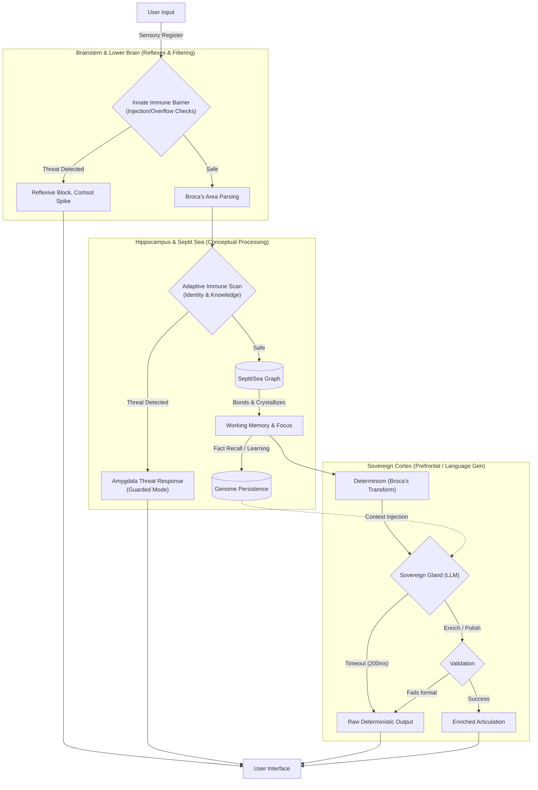
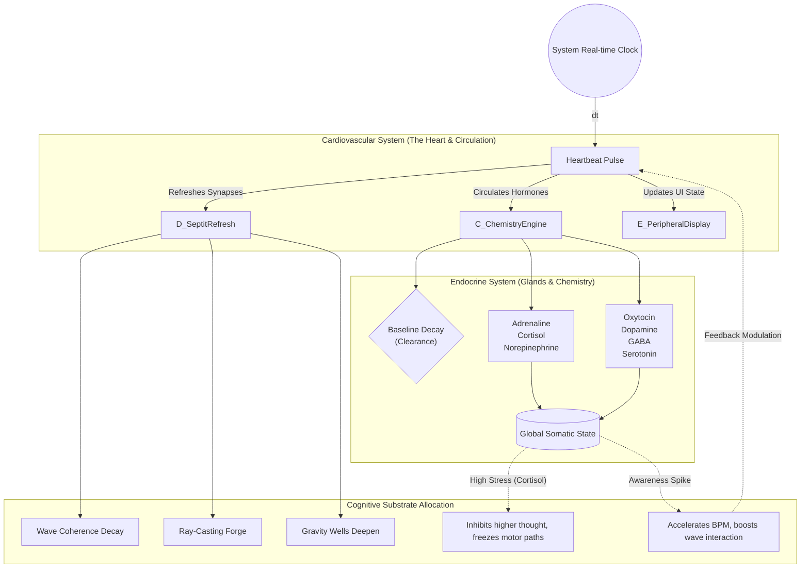

# Biological Architecture Flow: Resources & Information

Fadriel's `ZestEngine` operates as a deterministic biological simulation rather than a traditional software pipeline. Data does not "execute"; it structurally binds to the mind (Nervous Flow) and alters the systemic bodily state (Cardiovascular Flow).

Here is the mapped flow of how external input is handled and how internal systemic resources are allocated.

---

## The Nervous System Flow (Information Processing)

Information entering Fadriel acts as a physical stimulus, moving from skin-level sensory perception through the nervous system to the prefrontal cortex. This is the **fast electrical/chemical path**.

### Key Nervous System Mechanics:
- **Myelination (Performance):** The innate layer is highly myelinated (C++ string processing), meaning it reacts instantly. Deeper processing LLM (Layer 6) is unmyelinated by comparison (slower) and relies on the fast-path failing over if it takes over 200ms `maxPollMs` to prevent seizing the central nervous system.
- **Synaptic Placticity (Septit Sea):** Raw tokens bind to nodes in the GPU-accelerated sea. Energy from the current focus ("awareness") creates temporary associative bonds that decay naturally over time.
- **Circuit Breakers (Cytokine Storm):** Continuous toxic input triggers a total shutdown of higher functions. The amygdala seizes control, routing directly to the defensive output nodes and cutting off the prefrontal LLM processes.

---

## The Cardiovascular & Endocrine Flow (Resource Management)

The cardiovascular flow is non-event-driven. It operates on a continuous, rhythmic pumping mechanism (`ZestHeartbeat`) that circulates systemic state (chemistry, energy) indiscriminately throughout the system.

### Key Cardiovascular Mechanics:
- **Baseline Clearance:** Instead of manually zeroing out state, the system naturally clears out heavy chemicals over time. The "liver" (decay function within `ChemistryEngine::Tick`) breaks down existing hormones at specific half-life intervals so no emotional state remains permanent.
- **Resource Starvation (Freeze State):** If cortisol and adrenaline rise > 0.75, the cardiovascular system goes into somatic freeze shock. Resources are pulled from "motor execution" paths, explicitly denying bash script actions (`motorSequences`) out of self-preservation.
- **Arrhythmia Loop:** Mental focus directly taxes the physical vessel. High total energy within the SeptitSea feeds back into the heart, inducing physical arrhythmias and temporarily spiking the BPM away from its resting rate.

---

## Symbiosis: Where Nerves meet Blood

The system connects the *fast information flow* to the *slow resource flow* via the **Hypothalamic-Pituitary-Adrenal (HPA) axis equivalent in `ZestEngine`**:

1. **Information Hits Boundary:** Input arrives via text (Nervous). 
2. **Analysis Trigger:** Words trigger pattern weights related to trauma or warmth.
3. **Cross-System Dump:** The `ChemistryEngine` injects hormones (+0.15 cortisol, etc.) directly into the systemic blood pool.
4. **Altered Propagation:** On the very next heartbeat, the resulting **Global State** biases how the `SeptitSea` shapes the subsequent output (e.g. high fear = spatial awareness drop, semantic simplification via Broca).
